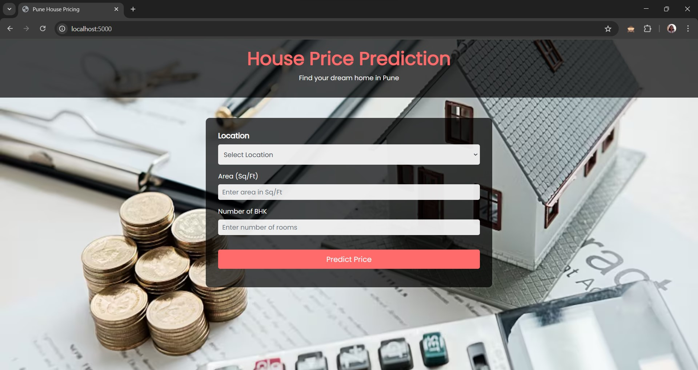
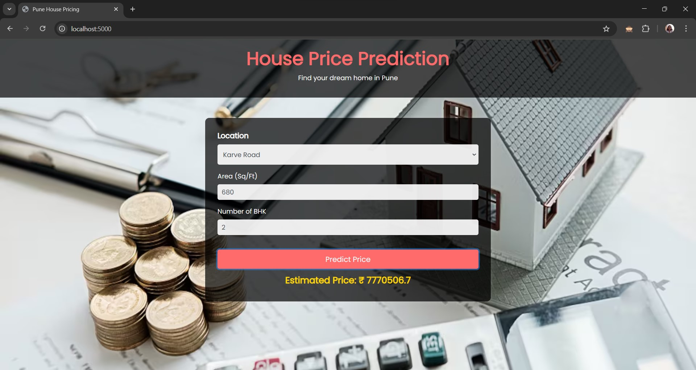

# House Price Prediction in Pune

## Task 
Task: Develop a Flask Web Application for House Price Prediction Using a Machine Learning Model.
## Overview
This project is a **Flask-based web application** that predicts house prices in Pune based on user inputs such as location, area, and number of BHK. The model is trained on real estate data to provide accurate price estimates.

## Installation
### 1. Clone the Repository
```sh
    git clone https://github.com/yourusername/house-price-prediction.git
    cd house-price-prediction
```

### 2. Create a Virtual Environment 
```sh
    .\myenv\Scripts\activate.bat  
```

### 3. Install Dependencies
```sh
    pip install -r requirements.txt
```
### 5. Run the Main file to Train
```sh
     python main.py
```

### 5. Run the Application
```sh
    python app.py
```

### 5. Access the Application
Open your browser and go to:
```
    http://localhost:5000
```

## Usage
1. Select a **Location** from the dropdown.
2. Enter the **Area (in Sq. Ft.)**.
3. Provide the **Number of BHKs**.
4. Click on **Predict Price** to get an estimated price.

## Screenshots




